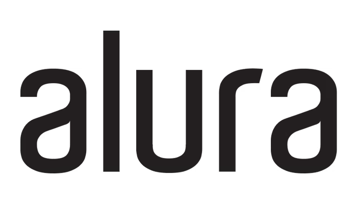
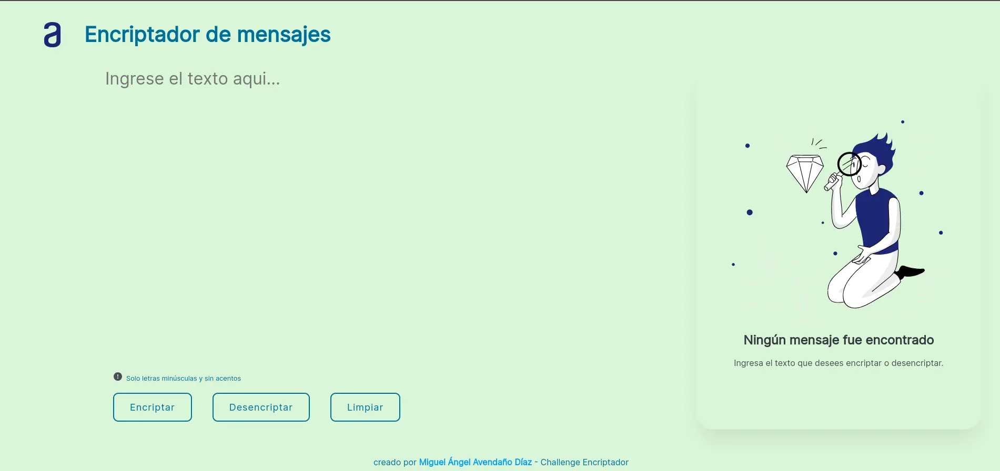

# Encriptador de texto Alura Challenges ONE G5 - 2023

|  |  |
| :----------------------------------------------: | :--------------------------------: |

## 📝 Descripción del desafío

El proyecto es una aplicación que debe encriptar y desencriptar texto 🔒. La encriptación se realiza mediante la sustitución de vocales por un conjunto de letras.

### 🔑 Las "llaves" de encriptación son

| 🔠 Llave | 🔡 Conversión |
| -------- | ------------- |
| a        | ai            |
| e        | enter         |
| i        | imes          |
| o        | ober          |
| u        | ufat          |

### ✅ Requisitos

- Debe funcionar solo con letras minúsculas.
- No deben ser utilizados letras con acentos ni caracteres especiales
- Debe ser posible convertir una palabra para la versión encriptada también devolver una palabra encriptada para su versión original.
- La página debe tener campos para inserción del texto que será encriptado o desencriptado, y el usuario debe poder escoger entre as dos opciones.
- El resultado debe ser mostrado en la pantalla.

### 🎁 Extras

Un botón que copie el texto encriptado/desencriptado para la sección de transferencia, o sea que tenga la misma funcionalidad del ctrl+C o de la opción "copiar" del menú de las aplicaciones.

Un botón que limpie todo el contenido, tanto el resultado, como el texto ingresado por el usuario.

### Tecnologías

	
    
    
	
	
	

    <a href="https://www.linkedin.com/in/miguel-angel-diaz-dev/">
        

